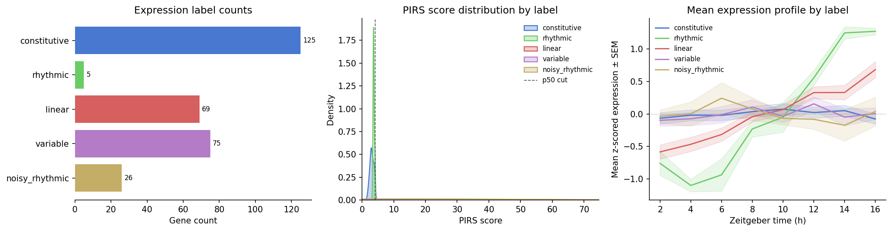
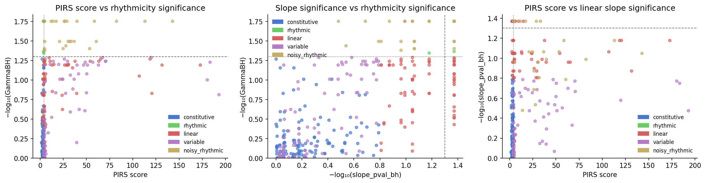
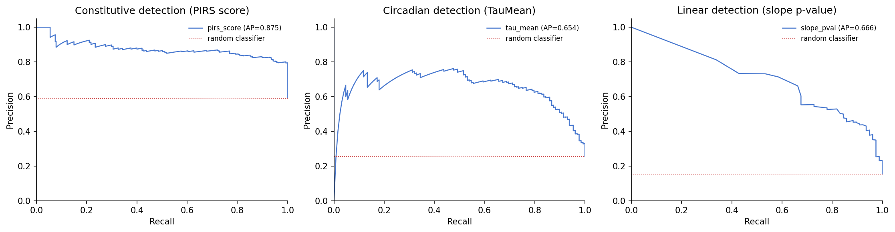
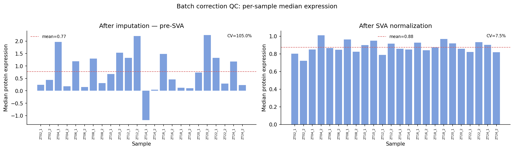
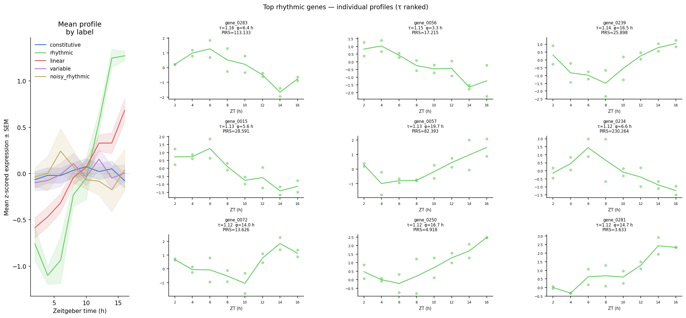
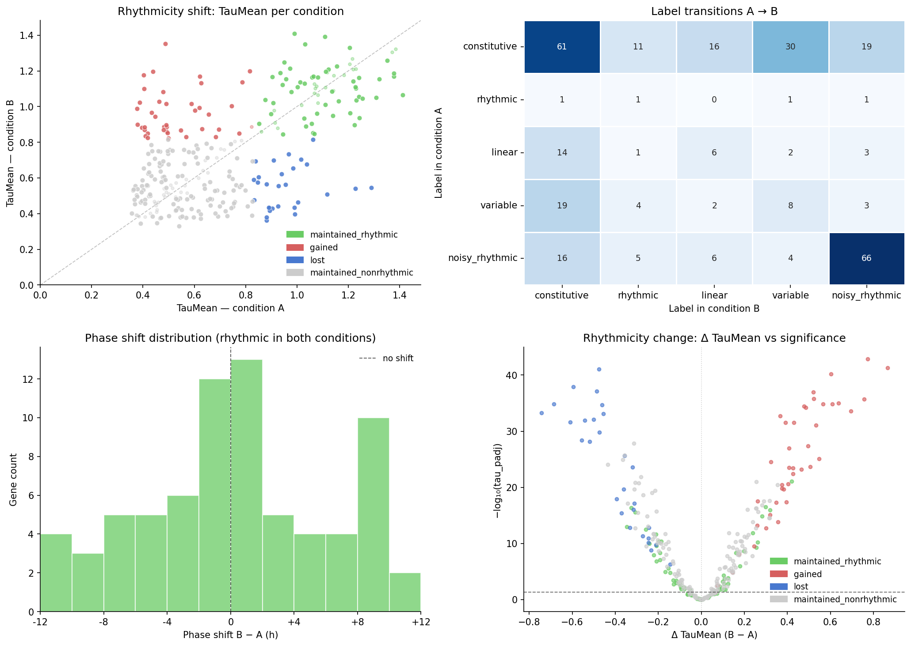
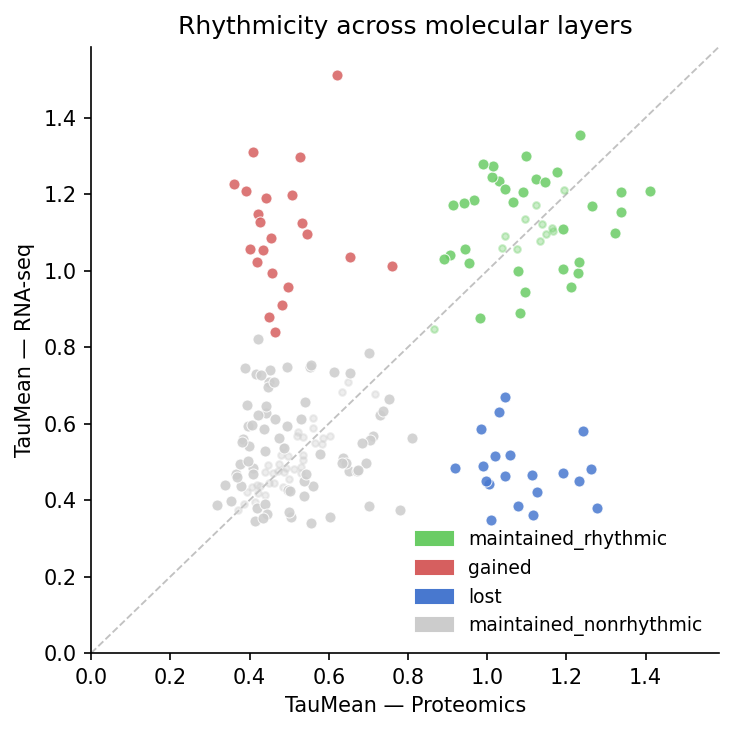

# CIRC — Example Scripts

Seven runnable examples that walk through the full CIRC workflow, from a
single classification run to a proteomics-scale pipeline with batch-effect
removal and cross-omics comparison.  Each script is self-contained: it
simulates its own data, runs the relevant CIRC steps, and writes figures to
`./figures/`.

## Prerequisites

```bash
poetry install          # installs all required dependencies
poetry install --extras fast   # optional: Numba-accelerated BooteJTK
```

## Running an example

```bash
poetry run python examples/<script>.py          # save figures only
poetry run python examples/<script>.py --show  # save + display interactively
```

All figures land in `./figures/`.  Intermediate files (imputed data,
normalized data, pool maps) are written to a `tempfile.TemporaryDirectory`
and cleaned up automatically when the script exits.

---

## Script catalogue

### 01 — Classify and explore ([`01_classify_and_explore.py`](01_classify_and_explore.py))

**Starting point for new users.**  Simulates a standard expression dataset,
classifies it with `Classifier.run_all()`, and produces three focused views:

- Dataset overview (label distribution, PIRS vs τ, phase wheel)
- Rhythmicity detail (amplitude histogram, phase–amplitude scatter,
  top rhythmic profiles)
- Constitutive characterization (top constitutive candidates, mean profiles
  by label)



Figures saved: `01_` – `04_`

---

### 02 — Validate decisions ([`02_validate_decisions.py`](02_validate_decisions.py))

Explores the classifier's decision space and shows how threshold changes
affect label distributions.  Useful for tuning sensitivity vs. specificity
before running on real data.

- PIRS score vs rhythmicity significance scatter
- Slope significance vs rhythmicity significance
- Threshold sensitivity analysis (how label counts shift as the PIRS cut-off moves)



Figures saved: `05_` – `09_`

---

### 03 — Benchmark simulation ([`03_benchmark_simulation.py`](03_benchmark_simulation.py))

Quantitative benchmarking against simulation ground truth.  Requires known
labels, so it always uses a simulation; swap in real data + ground-truth
labels from an independent assay to evaluate on your own dataset.

- Precision–recall curves for constitutive, circadian, and linear detection
- Multi-class ROC curves (one-vs-rest)
- Score comparison panels



Figures saved: `10_` – `14_`

---

### 04 — Proteomics pipeline ([`04_proteomics_pipeline.py`](04_proteomics_pipeline.py))

**Full proteomics workflow** with realistic noise.  Demonstrates every CIRC
step in sequence:

1. Simulate a proteomics dataset with two batch effects and 25 % missing values
2. KNN imputation (`imputable`)
3. SVA batch-effect removal (`sva`) with permutation testing
4. Classification (`Classifier`)
5. Before/after normalization QC (per-sample median plots)
6. Classification visualizations
7. Benchmark against ground truth

> `tpoints=12` is required for SVA — its circular-correlation window needs
> at least 12 unique timepoints.



Figures saved: `25_` – `30_`

---

### 05 — Gene inspection ([`05_gene_inspection.py`](05_gene_inspection.py))

Drilling into individual genes / proteins after classification:

- Profile gallery for the top-N rhythmic hits (raw traces + fitted cosine)
- Profile gallery for the top-N constitutive candidates
- Side-by-side comparison of a rhythmic and a constitutive profile

Useful for manual review of hits before follow-up experiments.



Figures saved: `15_` – `19_`

---

### 06 — Compare conditions ([`06_compare_conditions.py`](06_compare_conditions.py))

Two-condition comparison (e.g., wild-type vs. knock-out).  Classifies two
independently simulated datasets and compares them:

- TauMean scatter coloured by rhythmicity status (maintained / gained / lost)
- Phase-shift histogram for genes rhythmic in both conditions
- Label transition heatmap (condition A → condition B)
- Δ TauMean volcano plot with significance



Figures saved: `20_` – `24_`

---

### 07 — Cross-omics: proteomics vs RNA-seq ([`07_compare_proteomics_vs_expression.py`](07_compare_proteomics_vs_expression.py))

**Multi-omic comparison** across molecular layers.  Classifies proteomics and
RNA-seq datasets sharing the same feature identifiers, then identifies which
proteins/genes are rhythmic at each molecular level:

- Per-layer label distributions
- Cross-layer TauMean scatter coloured by rhythmicity status
- Divergent feature tables (protein-only rhythmic; RNA-only rhythmic)
- Peptide → protein aggregation workflow (`aggregate_to_protein`)



Figures saved: `31_` – `33_`

---

## Figure numbering convention

Scripts are assigned non-overlapping figure number ranges so figures from
different scripts can coexist in `./figures/` without collisions:

| Script | Figure range |
|---|---|
| 01 | 01 – 04 |
| 02 | 05 – 09 |
| 03 | 10 – 14 |
| 05 | 15 – 19 |
| 06 | 20 – 24 |
| 04 | 25 – 30 |
| 07 | 31 – 33 |

## Next steps

For full API documentation see the module READMEs:
[`circ.limbr`](../circ/limbr/README.md) ·
[`circ.pirs`](../circ/pirs/README.md) ·
[`circ.bootjtk`](../circ/bootjtk/README.md) ·
[`circ.expression_classification`](../circ/expression_classification/README.md) ·
[`circ.visualization`](../circ/visualization/README.md)
